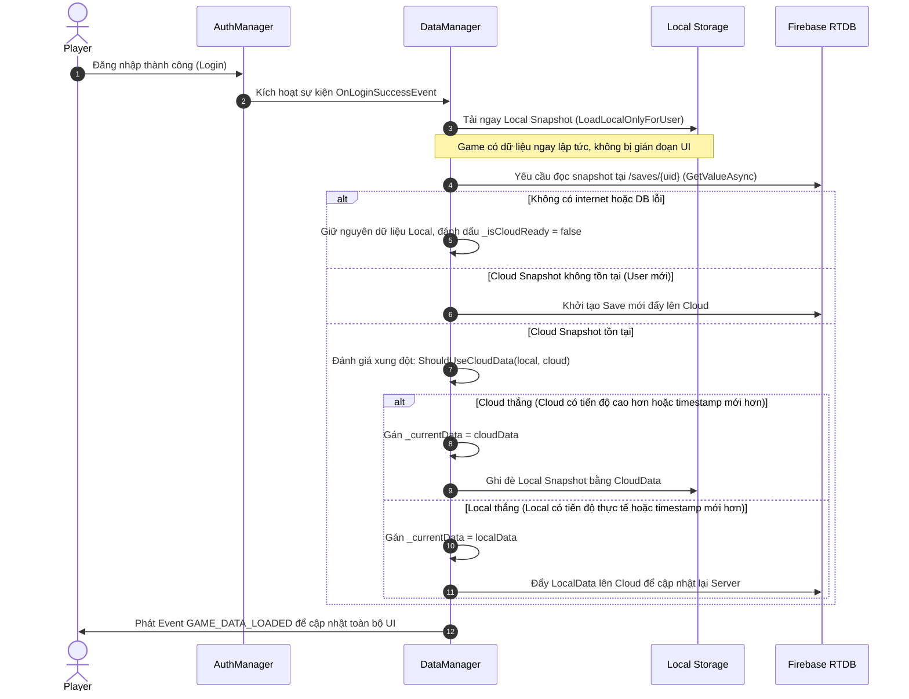
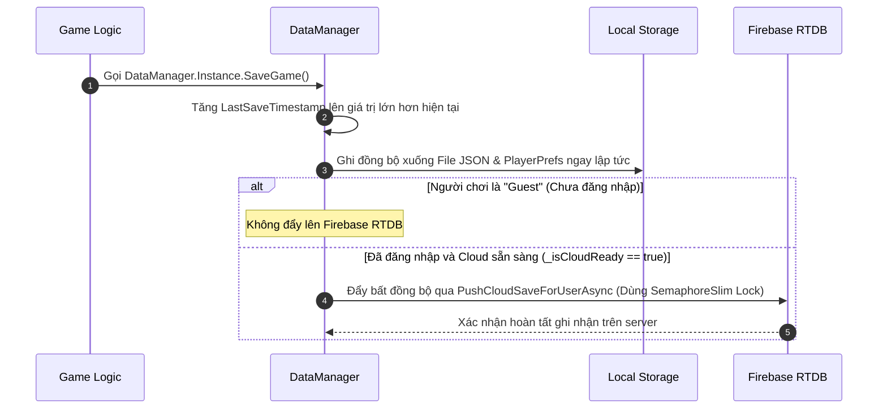
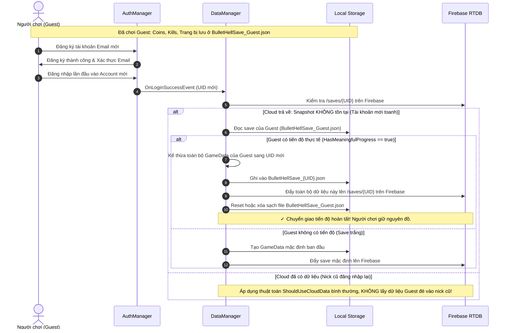

# Kiến Trúc & Cơ Chế Lưu / Tải Dữ Liệu Firebase (Save / Load & Sync)

Tài liệu này tổng hợp và phân tích chi tiết cơ chế **Lưu (Save)**, **Tải (Load)** và **Đồng bộ (Cloud Sync)** dữ liệu người chơi giữa **Local (Client)** và **Firebase Realtime Database (Cloud)** trong dự án **BulletHell**.

---

## 1. Tổng Quan Kiến Trúc (Architecture Overview)

Hệ thống quản lý dữ liệu trong game được vận hành bởi 3 thành phần cốt lõi:

```mermaid
graph TD
    A[UI / Gameplay Events] -->|SaveGame / AddCoins / AddKills| B[DataManager]
    C[AuthManager] -->|OnLoginSuccess / OnLogout| B
    B -->|1. Write Snapshot| D[(Local Storage: JSON File + PlayerPrefs)]
    B -->|2. Async Push| E[(Firebase Realtime Database: /saves/{uid})]
    E -->|Fetch Snapshot| B
    C -->|Authenticate / Manage Users| F[(Firebase Auth & /users/{uid})]
```

### Các lớp đối tượng chính:
1. **`AuthManager`** (`BulletHell.Features.Auth`):
   - Đảm nhiệm xác thực người dùng (Đăng ký, Đăng nhập, Quên mật khẩu, Chế độ Khách / Guest Mode, Xóa tài khoản).
   - Kết nối và duy trì kết nối tới Firebase Realtime Database URL (`DbRef`).
   - Cung cấp danh tính người dùng hiện tại: `CurrentUserId`, `CurrentUserEmail`, `IsLoggedIn`, `IsGuestMode`.
   - Node quản lý thông tin tài khoản trên DB: `/users/{uid}`.

2. **`DataManager`** (`BulletHell.Core`):
   - Quản lý trạng thái dữ liệu trong bộ nhớ (`CurrentData` kiểu `GameData`).
   - Tự động lưu trữ song song (Local JSON File + PlayerPrefs) theo từng UID người dùng (`BulletHellSave_{uid}.json`).
   - Phân tách hoàn toàn dữ liệu giữa các Tài khoản đã đăng ký (`UID`) và Chế độ Khách (`Guest`).
   - Thực hiện đồng bộ 2 chiều (Bidirectional Sync) giữa Local và Cloud với cơ chế giải quyết xung đột (Conflict Resolution).
   - Sử dụng `SemaphoreSlim` để đồng bộ luồng đẩy dữ liệu cloud tránh race condition.
   - Node quản lý save game trên Realtime DB: `/saves/{uid}`.

3. **`GameData` & `CharacterSaveData`** (`BulletHell.Data`):
   - Chứa thông tin chỉ số người chơi: Tiền tệ (`Coins`, `Kills`), tiến độ ải (`UnlockedMapIndexes`), trang bị (`InventoryEquipmentIDs`, `EquippedEquipmentIDs`), nhiệm vụ ngày (`DailyMissions`), thông số nâng cấp nhân vật (`Characters`).
   - Sử dụng `LastSaveTimestamp` (Unix timestamp milliseconds) để theo dõi phiên bản mới nhất của dữ liệu.

---

## 2. Cấu Trúc Lưu Trữ Dữ Liệu

### 2.1. Cấu Trúc Trên Firebase Realtime Database
```json
{
  "users": {
    "{uid}": {
      "uid": "abc123xyz...",
      "email": "player@gmail.com",
      "createdAt": 1727088000
    }
  },
  "saves": {
    "{uid}": {
      "Coins": 1500,
      "Kills": 350,
      "HighestLevel": 5,
      "HighScore": 12000,
      "UnlockedMapIndexes": [0, 1],
      "PlayerMaxHealth": 100.0,
      "PlayerDamage": 10.0,
      "PlayerSpeed": 5.0,
      "InventoryEquipmentIDs": ["wp_laser_01", "armor_iron_01"],
      "EquippedEquipmentIDs": ["wp_laser_01"],
      "SelectedCharacterID": "Char_01",
      "LastSaveTimestamp": 1727088920150,
      "LastDailyResetDateString": "2026-09-23",
      "DailyMissions": [...],
      "characterKeys": ["Char_01", "Char_02"],
      "characterValues": [...]
    }
  }
}
```

### 2.2. Cấu Trúc Lưu Trữ Tại Local (Client)
- **Đường dẫn File JSON:**  
  `Application.persistentDataPath/BulletHellSave_{safeUserId}.json`  
  *(Ví dụ: `BulletHellSave_abc123xyz.json` hoặc `BulletHellSave_Guest.json`)*
- **Bộ nhớ đệm PlayerPrefs dự phòng:**  
  Key: `SaveData_{userId}`

---

## 3. Quy Trình & Thuật Toán Tải Dữ Liệu (Load & Sync Flow)

Khi người dùng khởi động game hoặc đăng nhập thành công:



### Thuật toán giải quyết xung đột (`ShouldUseCloudData`):
1. **Kiểm tra tiến độ có ý nghĩa (`HasMeaningfulProgress`)**:
   - Nếu một bên có tiến độ (Coins > 0, Kills > 0, Map unlocked > 1, có trang bị, có nâng cấp) còn bên kia là save trắng (mới tinh) -> **Bên có tiến độ luôn thắng** (tránh trường hợp cài game trên máy mới ghi đè làm mất nick cũ).
2. **Cả hai cùng là save rỗng**: Ưu tiên **Cloud** làm chuẩn.
3. **Cả hai đều có tiến độ**:
   - So sánh `LastSaveTimestamp`: Bản có timestamp lớn hơn (mới hơn) sẽ được chọn.
   - Nếu timestamp bằng nhau: Ưu tiên **Cloud**.

---

## 4. Quy Trình Lưu Dữ Liệu (Save Flow)

Khi phát sinh thay đổi trạng thái (nhặt coin, nâng cấp chỉ số, mở khóa map, thoát game, dừng ứng dụng):



### Cơ chế chống mất dữ liệu khi lưu:
1. **Khóa chống tranh chấp (`SemaphoreSlim(1, 1)`)**: Đảm bảo các tác vụ ghi Cloud diễn ra tuần tự, không bị chèn ngang hoặc ghi đè sai thứ tự gói tin mạng.
2. **Kiểm tra UID & SyncVersion**: Nếu người chơi đăng xuất giữa lúc đang gửi request ghi Cloud, request đó sẽ bị hủy (`CancellationTokenSource`) và không ghi đè vào nick người khác.
3. **Cơ chế Fallback OnApplicationPause/Quit**: Luôn ghi cứng Snapshot vào Local File trước khi app bị đóng.

---

## 5. Cơ Chế Reset & Kiểm Tra Nhiệm Vụ Hằng Ngày (Daily Missions)

Hàm `InitializeDailyMissions(GameData data)` tự động:
1. So sánh `data.LastDailyResetDateString` với ngày hiện tại (`DateTime.Now.ToString("yyyy-MM-dd")`).
2. Nếu sang ngày mới:
   - Cập nhật lại ngày reset.
   - Đặt lại toàn bộ tiến độ nhiệm vụ về 0 (`currentProgress = 0`, `isCompleted = false`, `isClaimed = false`).
   - Tự động đồng bộ lại Local & Cloud.

---

## 6. Cơ Chế Quản Lý Tài Khoản (Account) & Chế Độ Khách (Guest Mode)

Hệ thống hỗ trợ song song 2 trạng thái người dùng với cơ chế cách ly dữ liệu độc lập:

```mermaid
graph TD
    subgraph GUEST_MODE[1. Chế Độ Khách - Guest Mode]
        G1[Người chơi chọn Chơi Khách / Guest] --> G2[AuthManager.SetGuestMode(true)]
        G2 --> G3[CurrentUserId = 'Guest']
        G3 --> G4[DataManager tải: BulletHellSave_Guest.json]
        G4 --> G5[Lưu game: CHỈ ghi xuống Local, KHÔNG đẩy lên Firebase]
    end

    subgraph ACCOUNT_MODE[2. Tài Khoản Đã Đăng Ký - Registered Account]
        A1[Người chơi Đăng Ký / Đăng Nhập Email] --> A2[Firebase Auth cấp UID duy nhất]
        A2 --> A3[CurrentUserId = UID]
        A3 --> A4[DataManager tải: BulletHellSave_{UID}.json]
        A4 --> A5[Tải & Đồng bộ 2 chiều với /saves/{UID} trên Realtime DB]
        A5 --> A6[Lưu game: Ghi đồng thời Local + Đẩy Cloud Snapshot]
    end
```

### 6.1. Chi Tiết Hoạt Động Của Chế Độ Khách (Guest Mode)
- **Kích hoạt:** Gọi `AuthManager.Instance.SetGuestMode(true)`.
- **Đặc điểm:**
  - `IsGuestMode = true`, `IsLoggedIn = true`.
  - `CurrentUserId = "Guest"`, `CurrentUserEmail = "guest@bullethell.local"`.
  - Không cần mạng Internet, không phụ thuộc vào `FirebaseApp` hay `FirebaseAuth`.
  - File dữ liệu local: `BulletHellSave_Guest.json` và PlayerPrefs key `SaveData_Guest`.
  - Hàm `IsGuestUser(userId)` trả về `true` $\rightarrow$ Tắt toàn bộ request đẩy lên cloud để tiết kiệm băng thông và bảo mật database.

### 6.2. Chi Tiết Hoạt Động Của Tài Khoản Đăng Ký (Registered Account)
- **Đăng ký (`RegisterAsync`):**
  1. Tạo tài khoản trên Firebase Authentication với Email và Password (tối thiểu 6 ký tự).
  2. Gửi email xác thực (`SendEmailVerificationAsync`).
  3. Ghi thông tin khởi tạo vào Realtime DB: `/users/{uid}`.
  4. Tự động `SignOut` để bắt buộc người chơi xác nhận qua Email trước khi được phép đăng nhập.
- **Đăng nhập (`LoginAsync`):**
  1. Xác thực thông tin với Firebase Authentication.
  2. Kiểm tra `user.IsEmailVerified` (bắt buộc trên build Release).
  3. Gán `IsGuestMode = false`, nạp thông tin hồ sơ `UserProfile` từ `/users/{uid}`.
  4. Kích hoạt `OnLoginSuccessEvent` $\rightarrow$ `DataManager` chuyển đổi sang UID của tài khoản và tiến hành tải/đồng bộ dữ liệu `/saves/{uid}`.

### 6.3. Cơ Chế Đăng Xuất & Chuyển Đổi Tài Khoản (Logout & Account Switching)
Khi người chơi bấm Đăng xuất (`AuthManager.Instance.Logout()`):
1. **Lưu dữ liệu an toàn:** Gọi `DataManager.Instance.SaveGame()` để đảm bảo toàn bộ tiến độ của tài khoản hiện tại được lưu xuống local và cloud trước khi hủy phiên.
2. **Hủy phiên:** `FirebaseAuth.SignOut()`, đặt lại `CurrentProfile = null`, `IsGuestMode = false`.
3. **Phát sự kiện:** Phát `OnLogoutEvent` và trigger `OnLogout` trên EventBus.
4. **Chuyển vùng dữ liệu:** `DataManager` hủy các tiến trình đồng bộ cloud cũ đang chạy dở (`CancelAccountSync`), đặt `_activeUserId = "Guest"`, giải phóng phiên nhân vật (`CharacterSession.Clear()`), và tải lại dữ liệu lưu của **Guest**.

---

## 7. Cơ Chế Đồng Bộ Từ Guest Sang Tài Khoản Mới (Guest to Account Migration)

### 7.1. Vấn đề thực tế trong game
Khi người chơi trải nghiệm game lần đầu dưới tư cách **Guest (Khách)**, họ đã cày cuốc đạt được tiến độ:
- Tiền tệ: `Coins`, `Kills`.
- Tiến độ: Mở khóa bản đồ (`UnlockedMapIndexes`), nhặt trang bị, nâng cấp chỉ số nhân vật.
- Dữ liệu này đang được lưu cục bộ tại `BulletHellSave_Guest.json`.

Khi người chơi quyết định **Đăng ký tài khoản mới** (Email/Password), nếu hệ thống không có cơ chế chuyển giao (Migration):
- UID mới được tạo ra $\rightarrow$ `DataManager` tải file `BulletHellSave_{NewUID}.json` (chưa có gì, là save trắng).
- Dữ liệu Guest cũ vẫn nằm ở `BulletHellSave_Guest.json` và **không được chuyển sang tài khoản mới**, khiến người chơi bị mất toàn bộ công sức cày cuốc trước đó.



### 7.2. Nguyên tắc an toàn khi Migrate Guest sang Account
1. **Chỉ Migrate khi Account là tài khoản mới toanh:**  
   Chỉ kích hoạt khi Firebase Snapshot tại `/saves/{UID}` chưa tồn tại (`!snapshot.Exists`) hoặc là save hoàn toàn chưa có tiến độ. Tránh tuyệt đối việc lấy dữ liệu Guest ghi đè làm mất nick của người chơi cũ đăng nhập trên máy.
2. **Kiểm tra tiến độ thực tế (`HasMeaningfulProgress`):**  
   Chỉ chuyển giao khi Guest thực sự có tiến độ (`Coins > 0`, `Kills > 0`, mở map, nâng cấp chỉ số,...).
3. **Dọn dẹp Guest sau khi chuyển giao thành công:**  
   Sau khi đã ghi dữ liệu vào UID mới và đẩy lên Cloud thành công, tiến hành reset `BulletHellSave_Guest.json` về trắng để tránh dữ liệu bị nhân bản trùng lặp nếu có người khác vào chơi Guest tiếp theo.

---

## 8. Xử Lý Các Trường Hợp Đặc Biệt (Edge Cases)

| Tình huống | Cách xử lý trong dự án |
| :--- | :--- |
| **Mất kết nối mạng khi chơi** | Tải/lưu tại Local bình thường. `_isCloudReady = false`. Khi có mạng và login lại, hệ thống sẽ tự động so sánh timestamp và đẩy bản Local mới lên Cloud. |
| **Đăng nhập trên thiết bị mới** | Thiết bị mới có save local rỗng -> Thuật toán `HasMeaningfulProgress` nhận biết Cloud có tiến độ -> Tải Cloud về đè Local. |
| **Chơi ở chế độ Guest (Khách)** | Dữ liệu chỉ lưu trong `BulletHellSave_Guest.json`, không kết nối hay chiếm dụng tài nguyên Cloud. |
| **Chuyển đổi giữa các tài khoản** | Mỗi tài khoản lưu ở 1 file `BulletHellSave_{uid}.json` riêng biệt, khi đổi tài khoản dữ liệu sẽ được chuyển đổi tương ứng mà không bị ghi đè lẫn nhau. |
| **Chuyển từ Guest sang Acc mới** | Tự động kiểm tra nếu nick mới chưa có dữ liệu $\rightarrow$ chuyển giao toàn bộ tiến độ Guest sang nick mới và đồng bộ lên Firebase. |
| **Đăng xuất tài khoản** | Lưu lại nick hiện tại trước khi SignOut -> Clear session -> Tải dữ liệu của Guest. |
| **Xóa tài khoản vĩnh viễn** | Xóa node `/users/{uid}`, xóa node `/saves/{uid}` trên Realtime DB, sau đó xóa User khỏi Firebase Auth và đăng xuất. |


